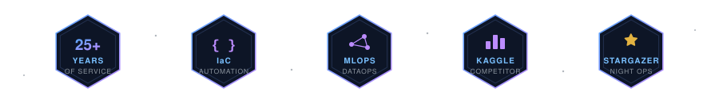
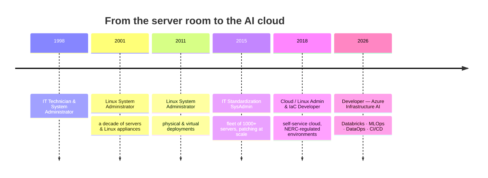

<div align="center">
  
</div>

<p align="center">
  <a href="https://github.com/dapiced">
    
  </a>
</p>

<p align="center">
  <a href="https://www.linkedin.com/in/dapiced/"></a>
  <a href="https://www.kaggle.com/dominicdapice"></a>
  <a href="https://huggingface.co/dapiced"></a>
  <a href="https://github.com/dapiced"></a>
</p>

<p align="center">
  
  
  
</p>

<br/>

## 🛰️ Mission Control

I design, deploy, and operate **Azure platforms that power AI workloads** — Databricks environments, data pipelines, and mission-critical systems. **25+ years** in the machine room taught me one thing: anything done twice by hand deserves to be automated.

- ⚙️ Building and operating **Databricks** platforms — clusters, jobs, models, pipelines — with performance, security, and compliance in mind
- 🔁 Automating operations end-to-end with **IaC, CI/CD, and orchestration**: fewer manual steps, more reliability
- 🤝 Partnering with Data Science, AI, and IT teams to turn business needs into scalable cloud solutions
- 📊 Applying **MLOps** and **DataOps** practices: model lifecycle, data governance, monitoring, observability
- 🎓 Currently pursuing a **University Certificate in Data Science** and competing on [**Kaggle**](https://www.kaggle.com/dominicdapice)

Because a profile should be reproducible, here is mine — as code:

```yaml
# ~/playbooks/dominic.yml
- name: Deploy Dominic D'Apice
  hosts: montreal.quebec.canada
  gather_facts: true

  vars:
    role: "Developer — Azure Infrastructure AI"
    experience: "25+ years"
    core_stack: [azure, databricks, ansible, terraform, python]
    fuel: [espresso, curiosity, starlight]

  tasks:
    - name: Automate everything that moves
      ansible.builtin.command: iac --no-manual-steps
      register: reliability

    - name: Train models, ship pipelines, compete on Kaggle
      loop: [mlops, dataops, machine_learning]

    - name: Look up at the night sky
      when: cloud_cover == 0        # the only time fewer clouds is better
      notify: stay_curious

  handlers:
    - name: stay_curious
      ansible.builtin.debug:
        msg: "Per aspera ad astra ✨"
```

<br/>

## 🚀 Featured Missions

<!-- Cards are generated by .github/workflows/snake.yml (scripts/generate_cards.py)
     from live GitHub data and published to the `output` branch — no third-party
     card service involved. -->
<div align="center">
  <a href="https://github.com/dapiced/cedd-hackathon">
    <picture>
      <source media="(prefers-color-scheme: dark)" srcset="https://raw.githubusercontent.com/dapiced/dapiced/output/repo-cedd-hackathon-dark.svg" />
      
    </picture>
  </a>
  <a href="https://github.com/dapiced/redhat_status_advanced">
    <picture>
      <source media="(prefers-color-scheme: dark)" srcset="https://raw.githubusercontent.com/dapiced/dapiced/output/repo-redhat_status_advanced-dark.svg" />
      
    </picture>
  </a>
  <a href="https://github.com/dapiced/rhel_vmware_disk_manager">
    <picture>
      <source media="(prefers-color-scheme: dark)" srcset="https://raw.githubusercontent.com/dapiced/dapiced/output/repo-rhel_vmware_disk_manager-dark.svg" />
      
    </picture>
  </a>
  <a href="https://github.com/dapiced/EnsembleLab">
    <picture>
      <source media="(prefers-color-scheme: dark)" srcset="https://raw.githubusercontent.com/dapiced/dapiced/output/repo-EnsembleLab-dark.svg" />
      
    </picture>
  </a>
  <a href="https://github.com/dapiced/redhat_satellite_capsule_ansible_role_install">
    <picture>
      <source media="(prefers-color-scheme: dark)" srcset="https://raw.githubusercontent.com/dapiced/dapiced/output/repo-redhat_satellite_capsule_ansible_role_install-dark.svg" />
      
    </picture>
  </a>
  <a href="https://github.com/dapiced/patch_update_yum">
    <picture>
      <source media="(prefers-color-scheme: dark)" srcset="https://raw.githubusercontent.com/dapiced/dapiced/output/repo-patch_update_yum-dark.svg" />
      
    </picture>
  </a>
</div>

<br/>

## 🧰 Onboard Systems

<div align="center">
  
  <br/>
  
</div>

<br/>

<details>
<summary><b>🔬 Full equipment manifest — click to expand</b></summary>
<br/>

| Domain | Technologies |
|---|---|
| **Cloud & Data Platforms** |    |
| **IaC & Automation** |      |
| **Languages** |     |
| **Operating Systems** |     |
| **Systems Management** |   |
| **Databases** |     |
| **CI/CD & DevOps** |        |

**Core strengths:** `Cloud Infrastructure` · `Infrastructure as Code` · `Automation & Scripting` · `DevOps & CI/CD` · `MLOps / DataOps` · `Security & Compliance (NERC, CIS)` · `Azure & Databricks` · `Team Collaboration`

</details>

<br/>

## 📡 Telemetry

<div align="center">
  <picture>
    <source media="(prefers-color-scheme: dark)" srcset="https://raw.githubusercontent.com/dapiced/dapiced/output/stats-dark.svg" />
    
  </picture>
  <picture>
    <source media="(prefers-color-scheme: dark)" srcset="https://raw.githubusercontent.com/dapiced/dapiced/output/langs-dark.svg" />
    
  </picture>
</div>

<div align="center">
  <picture>
    <source media="(prefers-color-scheme: dark)" srcset="https://streak-stats.demolab.com?user=dapiced&theme=tokyonight&hide_border=true" />
    
  </picture>
</div>

<br/>

<div align="center">
  <picture>
    <source media="(prefers-color-scheme: dark)" srcset="https://github-readme-activity-graph.vercel.app/graph?username=dapiced&theme=tokyo-night&hide_border=true&radius=8&area=true" />
    
  </picture>
</div>

<div align="center">
  
</div>

<div align="center">
  <picture>
    <source media="(prefers-color-scheme: dark)" srcset="https://raw.githubusercontent.com/dapiced/dapiced/output/github-snake-dark.svg" />
    
  </picture>
</div>

<br/>

## 🗺️ Flight Log — 25+ Years of Service



<details>
<summary><b>🎓 Education & Certifications — click to expand</b></summary>
<br/>

- **Bachelor Certificate, Information Technology Management** — *UQAM, Université du Québec à Montréal*
- **Diploma of College Studies (DSM)** — *Collège de Bois-de-Boulogne*
- **University Certificate in Data Science** *(almost finished!)*

**Specialized training:** Red Hat RHCE Rapid Track (RH299) · Red Hat Ansible / Tower · Red Hat Satellite · VMware Infrastructure & Aria Suite · IBM AIX Power System · F5 Big-IP LTM & APM · MS SQL · Security & Network Administration

</details>

<br/>

## 🔭 Beyond the Terminal

> After 25 years of managing clouds, I still spend my clearest nights looking at the real ones.

| | |
|---|---|
| 🌌 **Astronomy** | Exploring celestial objects and following the latest discoveries — from JWST deep fields to backyard skies |
| 🧠 **Artificial Intelligence** | Studying ML advances and how they translate into real-world impact — then testing myself on Kaggle |
| ⚛️ **Physics** | Fascinated by the fundamental laws that describe our universe — the original distributed system |

These passions feed my work: the same curiosity that scans the night sky also debugs the pipeline at 2 a.m.

<br/>

---

<p align="center"><em>"Delivering scalable, secure, and efficient infrastructure solutions aligned with business strategy."</em></p>

<p align="center">
  <code>#Azure</code> <code>#MLOps</code> <code>#DataOps</code> <code>#DataScience</code> <code>#MachineLearning</code> <code>#Kaggle</code> <code>#IaC</code> <code>#ContinuousLearning</code>
</p>

<div align="center">
  
</div>
